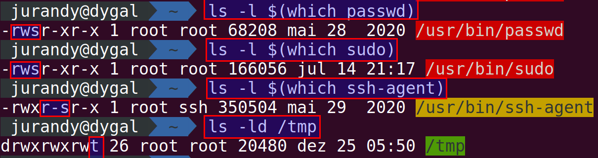

(permissoes)=

# Gerenciar direitos de acesso (propriedades e permissões) de arquivos e diretórios

- Traduzido de: <https://doc.ubuntu-fr.org/permissions>
- Tradutor: Jurandy Soares
- Data da tradução: 18/dez/2020

```{seealso}
{ref}`direitos`
```

Os sistemas operacionais inspirados no Unix (dos quais o Linux faz parte) têm a capacidade de definir de forma detalhada a gestão dos direitos de acesso aos vários arquivos do seu {term}`SO`.

Os direitos de acesso definidos em arquivos e diretórios não são imutáveis: eles podem ser alterados, a fim de acomodar novas necessidades que surgem com o tempo de uso de seu sistema Ubuntu. Este artigo explica as diferentes manipulações que podem ser aplicadas a arquivos e diretórios para alterar seus proprietários e permissões.

## Direitos de acesso: o que são?

Os direitos de acesso definem a propriedade de um arquivo ou diretório para um usuário e um grupo de usuários. Eles também gerenciam quais ações os usuários têm permissão para executar nos arquivos (ler, escrever e executar), dependendo se eles são o proprietário do arquivo, membro do grupo proprietário do arquivo ou nenhum dos dois. A propriedade e o gerenciamento das permissões associadas são feitos individualmente com cada arquivo.

- Consulte o documento explicativo {ref}`direitos`.

```{warning}
Este documento descreve as várias operações que podem ser executadas em arquivos e diretórios para modificar os vários direitos de acesso. Leva em consideração o seu conhecimento das categorias de proprietários de arquivos (usuário proprietário, grupo proprietário e "outros") e os três tipos de permissões (leitura, escrita e execução); todas essas informações estão reunidas no documento explicativo {ref}`direitos`. A descrição desses atributos não será discutida abaixo; Além disso, reserve um tempo para ler o documento explicativo antes de continuar a ler este artigo.
```

## Ver permissões

(guia-depermissoes)=

### Graficamente

No Nautilus (Ubuntu), clique com o botão direito em um arquivo ou diretório e escolha as **propriedades** . Vá para a guia de **permissões**. Na {numref}`fig-gui-perm-arq`, vemos as permissões do arquivo *letramento.ods*. Na {numref}`fig-gui-perm-dir`, vemos as permissões do diretório *Documentos*. 

```{figure} imagens/perm-arq-2020-12-18-13-53-46.png
:name: fig-gui-perm-arq
:align: center

-- Permissões para arquivos no Nautilus
```

```{figure} imagens/perm-dir-2020-12-18-13-54-32.png
:name: fig-gui-perm-dir
:align: center

-- Permissões para diretórios no Nautilus
```

Para o Proprietário, você pode escolher no menu suspenso correspondente conceder direitos de **leitura e escrita** ou **somente leitura** . Para **grupo** e **outros**, você pode escolher entre **leitura e escrita**, **somente leitura** e **nenhum** .

Você pode escolher o grupo ao qual o arquivo pertence (por padrão, [o grupo primário](https://docs.oracle.com/cd/E19120-01/open.solaris/819-2379/userconcept-35906/index.html) , exceto em casos especiais).

Ao lidar com um diretório, para o *Proprietário*, você pode escolher entre:

- Apenas listar arquivos
- Acessar arquivos
- Criar e excluir arquivos
  
Para *Grupo* e *Outros* , você pode escolher entre: 

- Nenhum
- Apenas listar arquivos
- Acessar arquivos
- Criar e excluir arquivos

```{tip}
A próxima seção (na linha de comando) detalha as diferentes possibilidades de permissões.
```

### Na linha de comando

Os direitos dos arquivos em um diretório podem ser exibidos usando o comando:

- `ls -l`

Os direitos de acesso aparecem então como uma lista de 10 símbolos:

- `drwxr-xr-x`

Estes símbolos devem ser interpretados conforme {numref}`tabela:ls-l`.

```{table} -- Símbolos com tipo de arquivos e permissões agrupadas por categoria: proprietário (**Usuário**), membros do grupo proprietário (**Grupo**) e resto do mundo (**Outros**)
:name: tabela:ls-l

|  `1`  | `2   3  4` | `5  6  7` | `8 9 10` |
| :---: | :--------: | :-------: | :------: |
|  `d`  | `r   w  x` | `r  -  x` | `r - x`  |
| Tipo  |  Usuário   |   Grupo   |  Outros  |

```

O primeiro símbolo pode ser `-`, `d` ou `l`, entre outros (todas as opções na [página de permissões Unix na wikipedia](https://en.wikipedia.org/wiki/File-system_permissions#Traditional_Unix_permissions)). Ele indica a natureza do arquivo:

- `-` : arquivo clássico
- `d` : diretório
- `l` : link simbólico
- `c` : dispositivo do tipo caracter
- `b` : dispositivo do tipo bloco
- `p` : *pipe* (FIFO) ou "tubo"
- `s` : socket

Em seguida, há 3 grupos com 3 símbolos cada, indicando se o arquivo (ou diretório) está autorizado para leitura, escrita ou execução (Em Inglês, <b>r</b>ead, <b>w</b>rite e e<b>x</b>ecute). Os 3 grupos correspondem, nesta ordem, aos direitos do proprietário, dos membros do grupo e depois do resto dos usuários. As letras `rwx` são usadas para simbolizar essas permissões. Se a permissão não for concedida, a letra em questão é substituída por `-`.

```{tip}
Outro comando muito prático permite visualizar de uma só vez os direitos (e os proprietários) de todos os diretórios pais (veja {ref}`caminhos`) de um recurso específico:

    namei -mo /caminho/
```

### Explicação por exemplo

Vamos voltar ao exemplo teórico anterior:

    drwxr-xr-x

A tradução é a seguinte:

- `d`: é um diretório.
- `rwx`: para o 1º grupo de 3 símbolos: seu dono pode ler, escrever e executar.
- `r-x` para o 2º grupo de 3 símbolos: o grupo só pode ler e executar o arquivo, sem poder modificá-lo.
- `r-x` para o 3º grupo de 3 símbolos: o resto do mundo só pode ler e executar o arquivo, sem poder modificá-lo.

Na prática, executando o seguinte comando:

- `ls -l`

obtemos a lista do conteúdo do diretório atual, por exemplo:

```
drwxr-xr-x   6 cyrille cyrille     4096 2008-10-29 23:09 Bureau
drwxr-x---   2 cyrille cyrille     4096 2008-10-22 22:46 Documents
lrwxrwxrwx   1 cyrille cyrille       26 2008-09-22 22:30 Examples -> /usr/share/example-content
-rw-r--r--   1 cyrille cyrille  1544881 2008-10-18 15:37 forum.xcf
drwxr-xr-x   7 cyrille cyrille     4096 2008-09-23 18:16 Images
drwxr-xr-x   2 cyrille cyrille     4096 2008-09-22 22:45 Modèles
drwxr-xr-x 267 cyrille cyrille    20480 2008-10-27 22:17 Musique
drwxr-xr-x   2 cyrille cyrille     4096 2008-09-22 22:45 Public
drwxr-xr-x   2 cyrille cyrille     4096 2008-10-26 13:14 Vidéos
```

Encontramos na primeira coluna o grupo de 10 caracteres que permitem conhecer os direitos de cada arquivo.

Assim, para o arquivo `forum.xcf`, temos:

- `-rw-r--r--`

- O primeiro caractere é `-` ⇒ é um arquivo.
- O primeiro grupo de 3 caracteres é `rw-` ⇒ o proprietário tem permissão de leitura e escrita (mas não de execução) no arquivo.
- Os 2 grupos a seguir são `r--` ⇒ Os usuários do grupo e os outros têm apenas direitos de leitura (sem escrita ou execução).

## Modificar permissões

```{tip}
As informações abaixo são muito importantes para entender e controlar as permissões. No entanto, se você deseja calcular rapidamente o valor de uma permissão, as ferramentas fazem isso por nós. Ex.: [calculadora CHMOD](https://www.onlineconversion.com/html_chmod_calculator.htm)
```

### Graficamente

No Nautilus, você só precisa alterar os valores dos menus suspensos na {ref}`guia de permissões <guia-depermissoes>`.

### Na linha de comando

Um arquivo tem um **proprietário** e um **grupo**. Podemos mudá-los.

#### chown, para mudar o dono
O comando [`chown`](chown-help) (<b>ch</b>ange <b>own</b>er, mudar o proprietário) permite que você altere o proprietário do arquivo. Apenas o usuário *root* ou o proprietário atual de um arquivo podem usar `chown`. O comando é usado da seguinte maneira:

- `sudo chown toto arquivo1`

O arquivo `arquivo1` agora pertence ao usuário toto.

#### `chgrp`, para mudar o grupo

O comando `chgrp` (<b>ch</b>ange <b>gr</b>ou<b>p</b>, mudar o grupo) permite que você altere o grupo ao qual o arquivo pertence. Todos os membros deste grupo serão afetados pelas permissões do grupo da segunda série de **rwx**.. Novamente, apenas o usuário *root* ou o proprietário atual de um arquivo podem usar `chgrp` (Um membro do grupo não pode alterar o grupo do proprietário). O comando é usado da seguinte maneira:

- `sudo chgrp meusAmigos arquivo2`

O arquivo `arquivo2` agora pertence ao grupo *meusAmigos*. Todos os membros do grupo *meusAmigos* terão acesso a este arquivo de acordo com as permissões do grupo. Quando o usuário atual não for o dono atual do arquivo, será necessário preceder o comando com `sudo`, uma vez que deve ser realizado com direitos administrativos.

#### chown, para alterar simultaneamente o proprietário e o grupo

Para alterar o proprietário e o grupo proprietário, uma sintaxe de comando especial `chown` pode ser usada. Novamente, apenas o usuário *root* ou o proprietário atual de um arquivo podem usar `chown` (um membro do grupo não pode alterar a propriedade). O comando é usado da seguinte maneira:

- `chown novo_proprietário:novo_grupo_proprietário nome_do_arquivo`

Quando o usuário atual não for o dono atual do arquivo, será necessário preceder o comando com `sudo`, uma vez que deve ser realizado com direitos administrativos.

Imagine o mesmo arquivo `foo.txt` pertencente ao *usuário1* e pertencente ao grupo proprietário  grupo *grupo1* . O proprietário deve se tornar o *usuário2* e o grupo proprietário deste arquivo deve ir para o grupo *grupo2*. Ao ser conectado à conta administrativa *usuário1*, a execução deste comando executará a operação solicitada:

- `sudo chown usuário2:grupo2 foo.txt`

####  chmod, para mudar os direitos

O comando `chmod`(<b>ch</b>ange <b>mod</b>e, mudar permissões) pode alterar as permissões em um arquivo. Ele pode ser usado de duas maneiras: ou especificando as permissões octal, usando os números; adicionando ou removendo permissões de uma ou mais categorias de usuário usando os símbolos `r`, `w` e `x`, que apresentamos acima. Preferimos apresentar primeiro esta segunda forma ("adicionar ou remover permissões usando símbolos"), pois provavelmente é mais intuitivo para iniciantes. Esteja ciente de que os dois métodos são equivalentes, ou seja, ambos afetam as permissões da mesma forma.

##### Gerenciando cada direito separadamente

Desta forma, iremos escolher:

1. A quem a mudança se aplica

   - `u` ( `u`suário) representa a categoria "proprietário";
   - `g` ( `g`rupo) representa a categoria "grupo proprietário";
   - `o` ( `o`utros) representa a categoria "resto do mundo";
   - `a` ( `a`ll, todos) representa todas as três categorias.

2. A modificação que queremos fazer

- `+`: adicionar
- `-`: deletar
- `=`: atribuir

3. O direito que queremos mudar:

- `r`: *read* ⇒ leitura
- `w`: *write* ⇒ escrita
- `x`: *execute* ⇒ execução
- `X`: *eXecute* ⇒ execução, diz respeito apenas a diretórios (quer eles já tenham permissão de execução ou não) e arquivos que já têm permissão de execução para uma das categorias de usuário. Veremos abaixo na parte do processamento recursivo o interesse de `X`.

Por exemplo:

- `chmod o-w arquivo3`

irá remover os direitos de escrita de outros.

- `chmod a+x arquivo4`

adicionará o direito de execução para as três categorias.

Podemos também pode combinar várias ações ao mesmo tempo:

- Adicionar permissão de leitura, escrita e execução ao arquivo `arquivo3` para o proprietário ;
- Adicionar permissão de leitura e execução ao grupo proprietário, remover permissão de escrita;
- Adicionamos permissão de leitura a outras pessoas, removemos a permissão de escrita e execução.

- `chmod u+rwx,g+rx-w,o+r-wx arquivo3`

etc.

##### Em octal

Em [octal](https://pt.wikipedia.org/wiki/Sistema_octal), cada "grupo" de direitos (para usuário, grupo e outros) será representado por um número e cada direito corresponde a um valor:

| Letra | Tradução   | Valor |
| ----- | ---------- | ----- |
| `r`   | (ler)      | 4     |
| `w`   | (escrever) | 2     |
| `x`   | (executar) | 1     |
| `-`   | (nenhum)   | 0     |

Por exemplo,

- Para `rwx`, teremos: 4 + 2 + 1 = 7
- Para `rw-`, teremos: 4 + 2 + 0 = 6
- Para `r--`, teremos: 4 + 0 + 0 = 4

Isso permite que você faça todas as combinações:

| Valor | Permissões | Significado                   |
| ----- | ---------- | ----------------------------- |
| 0     | ---        | (sem direitos)                |
| 1     | --x        | (execução)                    |
| 2     | -w-        | (escrita)                     |
| 3     | -wx        | (escrita e execução)          |
| 4     | r--        | (somente leitura)             |
| 5     | r-x        | (leitura e execução)          |
| 6     | rw-        | (leitura e escrita)           |
| 7     | rwx        | (leitura, escrita e execução) |

Vamos voltar ao diretório `Documents`. Suas permissões são:

- `drwxr-x ---`

Em octal, teremos **750**:

| Perm. p/ (u) | Perm. p/ (g) | Perm. p/ (o) |
| :----------: | :----------: | :----------: |
|     rwx      |      rx      |     ---      |
| (4 + 2 + 1)  | (4 + 0 + 1)  | (0 + 0 + 0)  |
|      7       |      5       |      0       |

Para colocar essas permissões no diretório, digitaríamos o comando:

- `chmod 750 Documents`

#### Recursivamente

Para cada um desses comandos, podemos executá-los recursivamente em um diretório. Em outras palavras, a ação será executada no diretório designado e em todos os arquivos ou diretórios que ele contém. Isso é feito adicionando a opção `-R`.

```{warning} 
Um uso indevido do `chmod -R` pode tornar seu sistema inutilizável. Evite executar o comando na raiz do sistema de arquivos (Ex.: `chmod -R [...] /`)
```

Por exemplo:

- `chmod -R 750 meuDiretório`

dará todos os direitos ao proprietário, direitos de leitura e execução para o grupo e nenhum direito para terceiros ...

##### Exemplo de aplicação que trata de maneira diferente diretórios e arquivos

Na verdade, se os diretórios devem ter a permissão `x` para poderem ser abertos, a permissão `x` é inútil para os arquivos não executáveis ​​e pode ser irritante para os arquivos de texto (txt, html ...) porque neste caso quando os abrimos cada vez receberemos uma mensagem perguntando se queremos abri-los ou lançá-los (como executáveis). Resumindo, o `x` certo deve ser reservado apenas para arquivos que são realmente executáveis.

**Aplicação 1:**

Seja um diretório *meudir*, contendo subdiretórios e arquivos. As permissões são `d rwx --- ---- (700)` para diretórios e `- rw --- --- (600)` para arquivos.

Queremos adicionar recursivamente os mesmos direitos  para o grupo (resp. `rwx` para os diretórios  e `rw` para os arquivos). Em outras palavras, queremos terminar com a seguinte situação: 

- `drwxrwx--- (770)` para diretórios e 
- `-rw-rw---- (660)` para arquivos.

Se executarmos `chmod -R 770 meudir`: os arquivos terão direitos de execução → ruim.

Se executarmos `chmod -R 660 meudir`: os diretórios não terão mais direitos de execução → catastrófico.

Se executarmos `chmod -R g+rwx meudir`: os arquivos terão direitos de execução → ruim.

Se executarmos `chmod -R g+rwX meudir`: apenas os diretórios (e os arquivos já executáveis) terão os direitos de execução → bom.

**Aplicação 2:**

Vamos imaginar que lançamos anteriormente o comando `chmod -R 770 meudir`. A situação é a seguinte: os direitos são `drwxrwx--- (770)` para diretórios e `-rwxrw---- (770)` para arquivos.

Queremos remover os direitos de execução apenas nos arquivos. Em outras palavras, queremos terminar com a seguinte situação: `drwxrwx--- (770)` para diretórios e `-rw-rw---- (660)` para arquivos.

Como *chmod* se aplica a arquivos e diretórios, estaremos fazendo malabarismos com `x` e `X`. Temos que remover `x` e, em seguida, adicionar `X`.

Se executarmos `chmod -R u-x+X,g-x+X meudir`, ele não terá efeito porque `X` diz respeito a ambos os diretórios E arquivos que têm um `x` em algum lugar. Portanto, se `u-x` remove o primeiro `x` (o que dá `-rw-rwx---`), a sequência `+X` colocará imediatamente um x de volta porque permanece um `x` (o do grupo!).

Portanto, devemos primeiro remover todos os `x`: `u-x,gx` antes de colocá-los de volta (será feito apenas para os diretórios desta vez), o que finalmente dá:

- `chmod -R u-x,g-x,u+X,g+X meudir`

```{tip}
Deve-se notar que apenas o dono do arquivo, bem como o superusuário, têm a possibilidade de modificar as permissões em um arquivo. (Um membro do grupo proprietário não pode alterar as permissões em um arquivo.) Quando o usuário atual não é o proprietário atual do arquivo, será necessário preceder o comando com [sudo](https://pt.wikipedia.org/wiki/Sudo), uma vez que terá que ser feito com o direitos de administração.
```

```{tip}
Observe também que para alterar os proprietários e as permissões em um arquivo que pertence a ele, o usuário deve ter absolutamente permissão de gravação nesse arquivo. Se ele tiver apenas permissão de leitura, não poderá alterar nenhum direito de acesso a este arquivo.
```

```{admonition} Duas outras opções muito práticas:
- Para exibir uma mensagem se e somente se as permissões foram alteradas:
    - `chmod -c <opção> <arquivo>`

- Para trabalhar recursivamente em todos os arquivos em um diretório e seus subdiretórios:
    - `chmod -R diretório`
``` 

## Direitos especiais

Às vezes, as permissões são especificadas com 4 dígitos, como `file_mode=0777`. Este primeiro número adicionado na frente pode ser usado para definir {term}`UID` ou {term}`GID` em tempo de execução ou o bit de grude (*stick bit*).

Digite na linha de comando:

    ls -l $(which passwd)
    ls -l $(which sudo)
    ls -l $(which ssh-agent)
    ls -ld /tmp

Você deve ver na lista de nomes de arquivo em um fundo vermelho ou amarelo e direitos do tipo abaixo onde `s` substitui o `x`.



Segue listagem dos comandos anteriores com sua respectiva saída:

- `ls -l $(which passwd)`
    - Saída: `-rwsr-xr-x 1 root root 68208 mai 28  2020 /usr/bin/passwd`

- `ls -l $(which sudo)`
  - Saída: `-rwsr-xr-x 1 root root 166056 jul 14 21:17 /usr/bin/sudo`

- `ls -l $(which ssh-agent)`
  - Saída: `-rwxr-sr-x 1 root ssh 350504 mai 29  2020 /usr/bin/ssh-agent`

- `ls -ld /tmp`
  - Saída: `drwxrwxrwt 28 root root 20480 dez 25 06:03 /tmp`

Podemos interpretar a saída conforme a tabela abaixo:

| Permissões | Links | Usuário | Grupo | Tamanho | Últ. modif.  | Nome               |
| ---------- | ----- | ------- | ----- | ------- | ------------ | ------------------ |
| -rwsr-xr-x | 1     | root    | root  | 68208   | mai 28 2020  | /usr/bin/passwd    |
| -rwsr-xr-x | 1     | root    | root  | 166056  | jul 14 21:17 | /usr/bin/sudo      |
| -rwxr-sr-x | 1     | root    | ssh   | 350504  | mai 29 2020  | /usr/bin/ssh-agent |
| drwxrwxrwt | 29    | root    | root  | 20480   | dez 25 03:18 | /tmp               |


O bit *Set-User-ID* permite que um usuário execute o programa com direitos de proprietário, então `sudo` nos permite executar comandos como "root". O bit *Set-Group-ID* faz o mesmo que o Set-User-ID, mas em relação ao grupo.

A restrição de exclusão ou *Sticky bit* permite, por sua vez, restringir a exclusão de um arquivo ou diretório ao seu único proprietário. Este é o caso do diretório `/tmp`. O `t` em vez dos `x` para outros usuários nos informa que este diretório somente pode ser excluído pelo usuário *root*. Como para as outras permissões, você pode acumular as ativações, adicionando o código para cada um, assim, para ativar o *sticky bit* e o *GroupID* em seu script `renomeia-minhas-fotos.sh`, você executaria:

- `chmod 3777 renomeia-minhas-fotos.sh`


